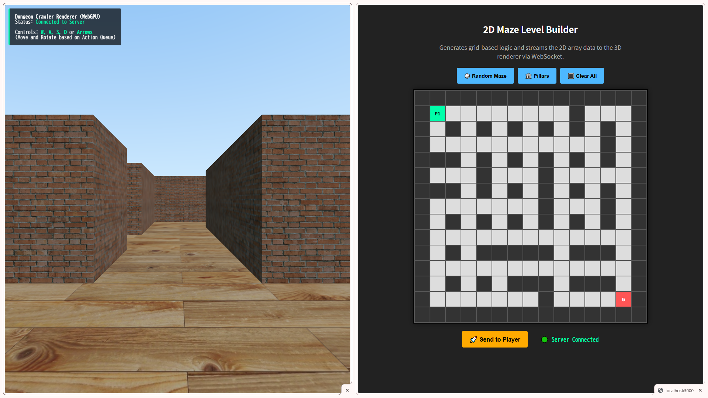

# WebSocket 3D Maze Streamer (WebGPU)

A minimalist Proof of Concept (PoC) demonstrating a **decoupled architecture** where 2D logic generation and 3D rendering are separated into different clients and synchronized in real-time via WebSockets.

The renderer utilizes the modern **WebGPU API** and **TSL (Three Shading Language)** via Three.js (r183).



## 🌟 Key Concept: "Decoupled Data and Rendering"

This project was built to demonstrate how structural data (like terrain or maze layouts) can be generated completely independently from the graphics engine.

1. **Generator (`editor.html`)**: A lightweight, pure HTML/JS client that builds a 2D array (maze logic) using a Depth-First Search algorithm or manual painting. **No 3D engine runs here.**
2. **Server (`server.js`)**: A simple Node.js WebSocket hub that stores the world state and broadcasts updates.
3. **Renderer (`player.html`)**: A Three.js WebGPU client that listens to the data stream and dynamically reconstructs the 3D meshes on the fly.

This architecture serves as a foundational step toward more complex systems (such as streaming procedural geometry from a Rust/C++ backend or heavy physics simulations).

## 🚀 Features
* **Real-time Synchronization**: Paint walls in the 2D editor and instantly see them pop up in the 3D world.
* **Modern Graphics API**: Uses `THREE.WebGPURenderer` and `MeshBasicNodeMaterial` (TSL).
* **Grid-Based Movement**: The player client features a queued, smooth-interpolated grid movement system (Dungeon Crawler style).
* **Zero-Dependency Clients**: The HTML clients run directly in the browser using ES Modules (via CDN). No bundlers (Webpack/Vite) required.

## 🛠️ Installation & Setup

### Prerequisites
* [Node.js](https://nodejs.org/) installed on your machine.
* A WebGPU-compatible browser (e.g., Chrome 113+, Edge 113+).

### 1. Clone the repository
```bash
git clone https://github.com/MEBYCentral/websocket-maze-streamer.git
cd websocket-maze-streamer
```

### 2. Install Server Dependencies
The server only requires the `ws` package for WebSocket communication.
```bash
npm install ws
```

### 3. Start the Server
```bash
node server.js
```
The server will start listening on `ws://localhost:8080`.

### 4. Open the Clients
Because the clients import Three.js as an ES Module, you should serve the HTML files using a local web server to avoid CORS issues.

You can use any simple HTTP server. For example:
```bash
# Using Python
python -m http.server 3000

# OR using Node.js 'serve'
npx serve -p 3000
```

Then, open two browser windows side-by-side:
1. **The Editor**: `http://localhost:3000/editor.html`
2. **The Player**: `http://localhost:3000/player.html`

## 🎮 How to Use

### In the Editor (`editor.html`):
* Click on any empty cell to place a wall (Dark grey).
* Click on a wall to remove it.
* Use the **🎲 Random Maze** button to generate a fully solvable maze automatically.
* Use the **🔳 Clear All** button to reset the grid.
* The changes are sent to the 3D renderer instantly.

### In the Player (`player.html`):
* **W / Up Arrow**: Move Forward
* **S / Down Arrow**: Move Backward
* **Q / E**: Strafe Left / Right
* **A / D**: Rotate 90 degrees Left / Right
* The camera will smoothly transition from cell to cell based on the action queue.

## 🏗️ Folder Structure
```text
.
├── server.js      # Node.js WebSocket server
├── editor.html    # 2D Grid Level Builder (Data Source)
├── player.html    # 3D WebGPU Renderer (Data Consumer)
├── package.json   # Server dependencies
└── README.md
```

## 📝 Technical Notes
* The Three.js library is loaded directly via the `importmap` specifier in the HTML files, pulling the `webgpu` and `tsl` builds from a CDN.
* The movement logic uses a queue system (`actionQueue`). This ensures that rapid keystrokes do not break the animation or allow clipping through walls.

## 📄 License
This project is open-source and available under the [MIT License](LICENSE).
